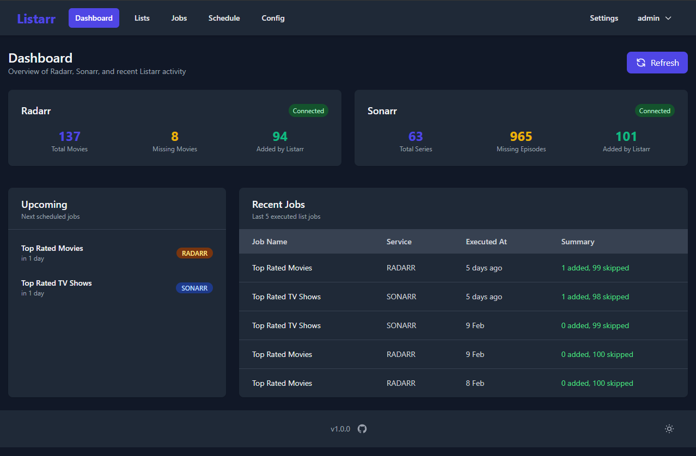
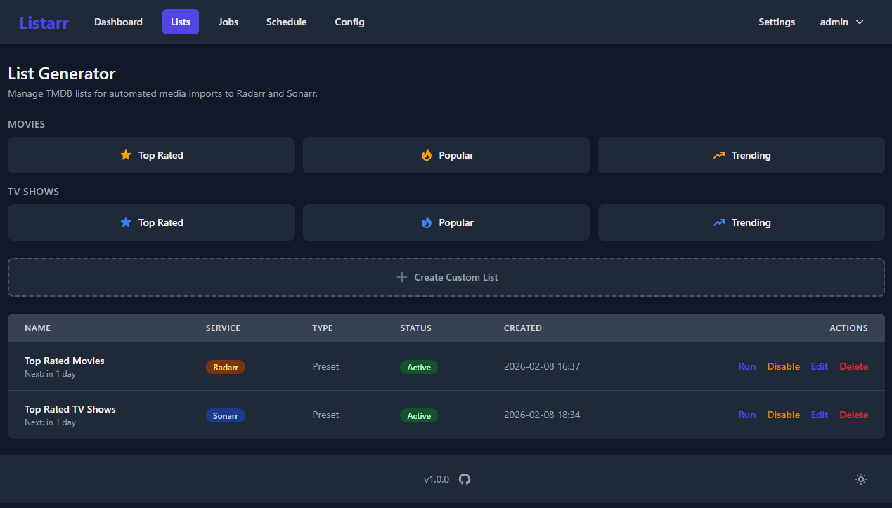
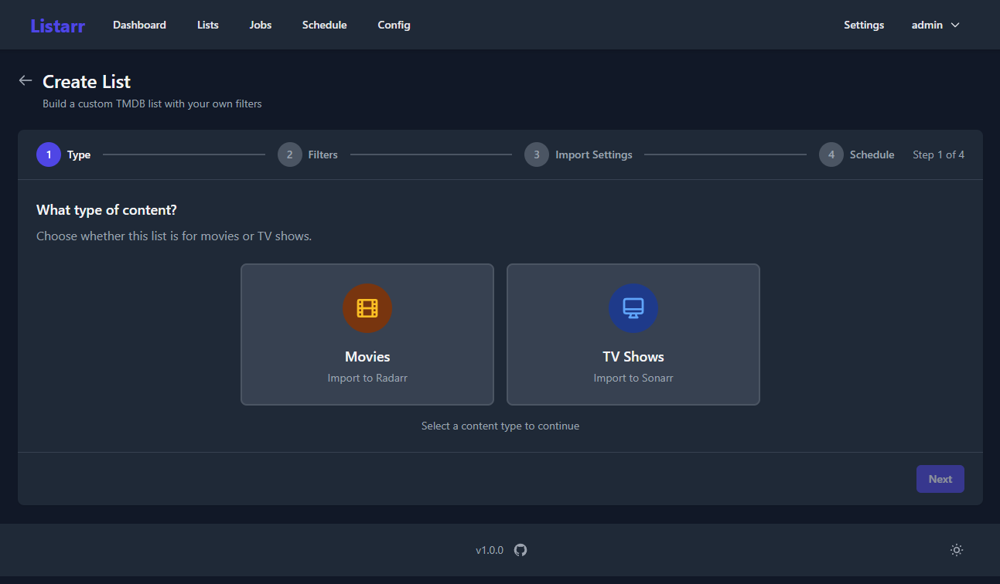
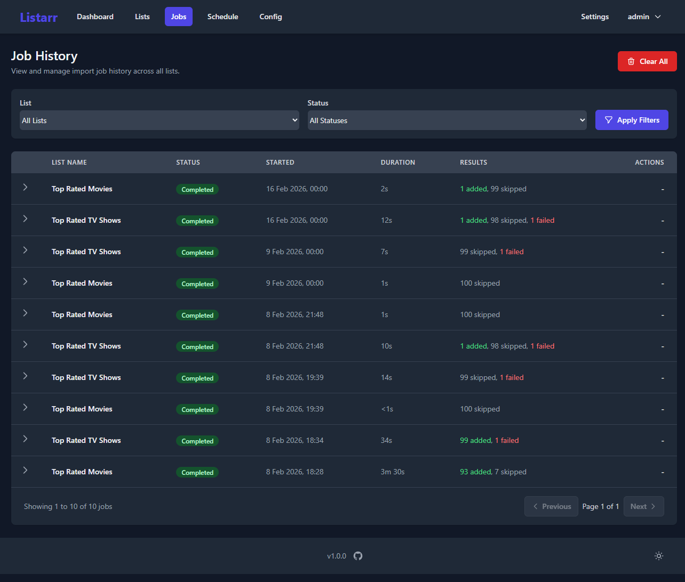

# Listarr

Automated media discovery and import for Radarr/Sonarr via TMDB.

[](https://github.com/fisherd80/listarr/actions/workflows/ci.yml)
[](https://hub.docker.com/r/fisherd91/listarr)
[](LICENSE)

---

## Screenshots

<!-- Screenshots captured in dark mode using the footer toggle -->

| Dashboard | Lists |
|-----------|-------|
|  |  |

| Wizard | Jobs |
|--------|------|
|  |  |

---

## Features

**TMDB Discovery**

- Browse Trending, Popular, and Top Rated movies and TV shows
- Discover content with filters: genre, year, rating, language, region
- Live preview of results before committing to an import
- Multi-step list creation wizard with preset templates

**Media Import**

- Import movies directly into Radarr with configurable quality profiles, root folders, tags, and monitoring settings
- Import TV shows directly into Sonarr with quality profiles, root folders, season folders, tags, and monitoring settings
- Per-list import setting overrides (fall back to global defaults when not set)
- Bulk import API for batch operations — 50 items per batch, significantly faster than one-at-a-time imports
- Conflict handling: items already in your library are skipped automatically

**Automation**

- Cron-based scheduling with preset intervals (hourly, daily, weekly, monthly)
- Custom cron expressions for advanced scheduling requirements
- Global scheduler pause and resume for maintenance windows
- Pre-flight health checks before each scheduled job execution

**Monitoring**

- Dashboard with read-only stats from Radarr and Sonarr (total, missing, "Added by Listarr" counters)
- Job monitoring page with filtering, pagination, and expandable per-item details
- Recent activity feed on dashboard with status indicators
- Background job execution with activity-based idle timeout

**Security**

- Single-user authentication with setup wizard on first run
- API keys encrypted at rest using Fernet symmetric encryption
- CSRF protection on all forms and AJAX requests
- Security headers: Content-Security-Policy, X-Frame-Options, X-Content-Type-Options
- Secure session cookies: HttpOnly, SameSite=Lax, configurable Secure flag for HTTPS
- Open redirect prevention on login

---

## Quick Start

### Docker Compose (recommended)

1. **Download the compose file**

   ```bash
   curl -O https://raw.githubusercontent.com/fisherd80/listarr/main/docker-compose.yml
   ```

2. **Copy the environment template**

   ```bash
   curl -O https://raw.githubusercontent.com/fisherd80/listarr/main/.env.example
   cp .env.example .env
   ```

3. **Start the container**

   ```bash
   docker compose up -d
   ```

4. **Open Listarr**

   Navigate to [http://localhost:5000](http://localhost:5000). You will be redirected to the setup wizard to create your account on first run.

5. **View logs**

   ```bash
   docker compose logs -f listarr
   ```

The `docker-compose.yml` uses a bind mount at `./instance` for the database and encryption key, so your data persists across container rebuilds.

---

### Development Setup

1. **Clone the repository**

   ```bash
   git clone https://github.com/fisherd80/listarr.git
   cd listarr
   ```

2. **Install dependencies**

   ```bash
   pip install -r requirements.txt
   ```

3. **Run first-time setup**

   ```bash
   python setup.py
   ```

   This generates the encryption key at `instance/.fernet_key` and creates the SQLite database at `instance/listarr.db`.

4. **Start the development server**

   ```bash
   python run.py
   ```

5. **Open Listarr**

   Navigate to [http://localhost:5000](http://localhost:5000). You will be redirected to the setup wizard to create your account on first run.

---

## Configuration

### First Run

On first access, Listarr redirects you to `/setup` where you create your account (username and password). This step is blocked once an account exists.

If you are locked out, reset your password from the command line:

```bash
python setup.py --reset-password
```

### API Keys

All API keys are configured through the web interface and encrypted before storage.

- **TMDB API Key** — Settings page (`/settings`). Required before creating any lists.
- **Radarr** — Config page (`/config`). Enter your Radarr URL and API key, then use "Test Connection" to verify.
- **Sonarr** — Config page (`/config`). Enter your Sonarr URL and API key, then use "Test Connection" to verify.

### Import Settings

Global import defaults for Radarr and Sonarr are set on the Config page. These apply to all lists unless a list has its own overrides configured in Step 3 of the wizard.

Settings include: quality profile, root folder, monitor mode, search on add, tags, and season folder (Sonarr only).

---

## Environment Variables

| Variable | Default | Description |
|----------|---------|-------------|
| `LISTARR_SECRET_KEY` | (auto-generated) | Flask secret key for session signing. Auto-generated to `instance/.secret_key` on first run. |
| `FERNET_KEY` | (from file) | Fernet encryption key for API keys at rest. Auto-generated to `instance/.fernet_key` on first run. Only override when migrating from another instance. |
| `TZ` | `UTC` | Server timezone used to interpret cron schedule expressions. Examples: `America/New_York`, `Europe/London`. |
| `LOG_LEVEL` | `INFO` | Python logging level. Options: `DEBUG`, `INFO`, `WARNING`, `ERROR`. |
| `FLASK_DEBUG` | `false` | Enable Flask debug mode. Never enable in production. |
| `SECURE_COOKIES` | `false` | Enable Secure flag on session and remember-me cookies. Set to `true` when serving behind an HTTPS reverse proxy. |
| `LOG_ACCESS_REQUESTS` | `false` | Enable Gunicorn access logging for all requests. By default only 4xx/5xx responses are logged. |

See [.env.example](.env.example) for a ready-to-use template.

---

## Known Limitations

- **Single-user only** — no multi-user support, roles, or permissions. Designed for personal homelab use.
- **Homelab deployment** — not hardened for direct public internet exposure. Use a reverse proxy (nginx, Caddy, Traefik) with authentication if you need external access.
- **SQLite only** — no PostgreSQL or MySQL support. SQLite with WAL mode handles typical single-user workloads without issue.
- **Read-only dashboard** — Listarr shows stats from Radarr/Sonarr but does not edit or delete existing media. It only pushes new imports.
- **No dry-run mode** — imports are executed immediately when a list is run. Use the wizard preview step to review content before saving a list.

---

## Roadmap

v1.0.0 is the initial release, covering the full discovery-to-import workflow with scheduling, monitoring, and authentication.

Possible future enhancements:

- Multi-service instance support (multiple Radarr or Sonarr instances)
- Advanced TMDB filtering (cast, crew, collection-based lists)
- Import history analytics and reporting
- Webhook-triggered list execution
- Additional list sources beyond TMDB

---

## Contributing

Contributions are welcome. Please open an issue to discuss the change before submitting a pull request.

---

## Built with

Flask, SQLAlchemy, Tailwind CSS, APScheduler, Gunicorn. No third-party API wrappers — all Radarr, Sonarr, and TMDB calls use direct HTTP.

---

## License

This project is licensed under the MIT License. See the [LICENSE](LICENSE) file for details.
