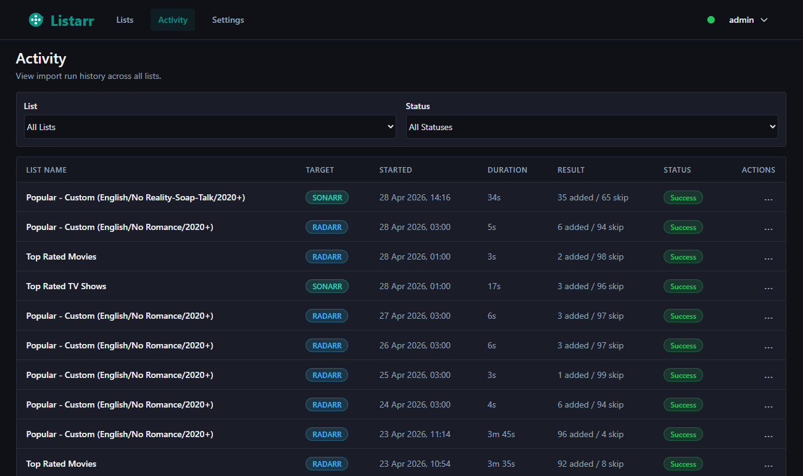
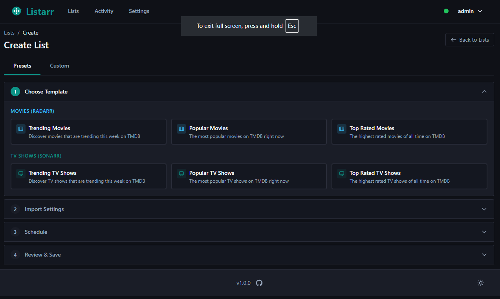
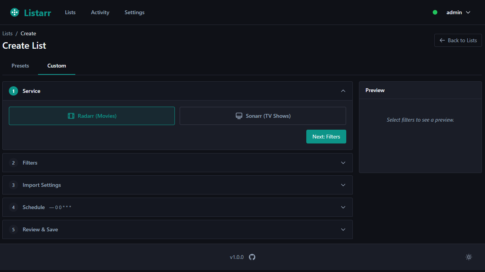

<div align="center">
  
</div>

# Listarr

Automated media discovery and import for Radarr/Sonarr via TMDB.

[](https://github.com/fisherd80/listarr/actions/workflows/listarr-ci.yml)
[](https://hub.docker.com/r/fisherd91/listarr)
[](CHANGELOG.md)
[](LICENSE)

> Listarr is not affiliated with Radarr, Sonarr, the Servarr project, or TMDB. You will need your own API keys for each service.

---

## Table of Contents

- [Screenshots](#screenshots)
- [Features](#features)
- [Quick Start](#quick-start)
  - [Docker Compose](#docker-compose-recommended)
  - [Unraid](#unraid)
  - [Development Setup](#development-setup)
- [Configuration](#configuration)
- [Environment Variables](#environment-variables)
- [Known Limitations](#known-limitations)
- [Roadmap](#roadmap)
- [Support](#support)
- [Contributing](#contributing)
- [Built with](#built-with)
- [License](#license)

---

## Screenshots

<!-- Screenshots captured in dark mode using the footer toggle -->

| Lists | Activity |
|-----------|-------|
|  |  |

| Wizard |  |
|--------|----------|
|  |  |

---

## Features

**TMDB Discovery**

- Browse Trending, Popular, and Top Rated movies and TV shows
- Discover content with filters: genre, year, rating, language, region
- Live preview of results before committing to an import
- Multi-step list creation wizard with preset templates

**Media Import**

- Import movies directly into Radarr with configurable quality profiles, root folders, tags, and monitoring settings
- Import TV shows directly into Sonarr with quality profiles, root folders, season folders, tags, and monitoring settings
- Per-list import setting overrides (fall back to global defaults when not set)
- Bulk import API for batch operations — 50 items per batch, significantly faster than one-at-a-time imports
- Conflict handling: items already in your library are skipped automatically

**Automation**

- Cron-based scheduling with preset intervals (hourly, daily, weekly) or custom cron expressions
- Global scheduler pause and resume for maintenance windows
- Pre-flight health checks before each scheduled job execution

**Monitoring**

- Activity page with filtering, pagination, and expandable per-item details
- Background job execution with activity-based idle timeout

**UI**

- Dark and light themes switchable via a footer toggle
- Semantic CSS token system — all colours adapt consistently across every page

**Security**

- Single-user authentication with setup wizard on first run
- API keys encrypted at rest using Fernet symmetric encryption
- CSRF protection on all forms and AJAX requests
- Security headers: Content-Security-Policy, X-Frame-Options, X-Content-Type-Options
- Secure session cookies: HttpOnly, SameSite=Lax, configurable Secure flag for HTTPS
- Open redirect prevention on login

---

## Quick Start

### Docker Compose (recommended)

1. **Create a directory and download the compose file**

   ```bash
   mkdir listarr && cd listarr
   curl -O https://raw.githubusercontent.com/fisherd80/listarr/main/docker-compose.yml
   ```

2. **Start the container**

   ```bash
   docker compose up -d
   ```

3. **Open Listarr**

   Navigate to [http://localhost:5000](http://localhost:5000). You will be redirected to the setup wizard to create your account on first run.

4. **View logs**

   ```bash
   docker compose logs -f listarr
   ```

The compose file pulls the latest image from Docker Hub and uses a bind mount at `./instance` for the database and encryption key, so your data persists across container updates.

**Optional:** To customize environment variables (timezone, logging, HTTPS cookies), download the [`.env.example`](.env.example) template, save it as `.env` in the same directory, and edit as needed. The compose file will load it automatically if present.

---

### Unraid

An Unraid community application template is available at [`deployment/unraid-template.xml`](deployment/unraid-template.xml). Community Applications store listing is pending approval.

Until the store listing is live, install manually by adding the following URL to the **Template repositories** field in Unraid Community Applications settings:

```
https://raw.githubusercontent.com/fisherd80/listarr/main/deployment/unraid-template.xml
```

Or use Docker Compose directly.

Configure the **App Data** path to a persistent location (e.g. `/mnt/user/appdata/listarr`) and set your timezone. All other settings are optional.

---

### Development Setup

**Prerequisites:** Python 3.11+

1. **Clone the repository**

   ```bash
   git clone https://github.com/fisherd80/listarr.git
   cd listarr
   ```

2. **Install dependencies**

   ```bash
   pip install -r requirements.txt          # Production dependencies
   pip install -r requirements-dev.txt      # Dev tools: ruff, pytest, bandit, pre-commit
   ```

3. **Run first-time setup**

   ```bash
   python manage.py
   ```

   This generates the encryption key (`instance/.fernet_key`), the session secret key (`instance/.secret_key`), and the SQLite database (`instance/listarr.db`).

4. **Start the development server**

   ```bash
   python run.py
   ```

5. **Open Listarr**

   Navigate to [http://localhost:5000](http://localhost:5000). You will be redirected to the setup wizard to create your account on first run.

---

## Configuration

### First Run

On first access, Listarr redirects you to `/setup` where you create your account (username and password). This step is blocked once an account exists.

If you are locked out, reset your password from the command line:

```bash
python manage.py --reset-password
```

### API Keys

All API keys are configured through the Settings page (`/settings`) and encrypted before storage.

- **TMDB API Key** — Enter your TMDB API key and select a region, then use "Test Connection" to verify.
- **Radarr** — Enter your Radarr URL and API key, then use "Test Connection" to verify.
- **Sonarr** — Enter your Sonarr URL and API key, then use "Test Connection" to verify.

### Import Settings

Global import defaults for Radarr and Sonarr are configured on the Settings page (`/settings`). These apply to all lists unless a list has its own overrides configured in Step 3 of the wizard.

Settings include: quality profile, root folder, monitor mode, search on add, tags, and season folder (Sonarr only).

---

## Environment Variables

| Variable | Default | Description |
|----------|---------|-------------|
| `LISTARR_SECRET_KEY` | (auto-generated) | Flask secret key for session signing. Auto-generated to `instance/.secret_key` on first run. |
| `FERNET_KEY` | (from file) | Fernet encryption key for API keys at rest. Auto-generated to `instance/.fernet_key` on first run. Only override when migrating from another instance. |
| `TZ` | `UTC` | Server timezone used to interpret cron schedule expressions. Examples: `America/New_York`, `Europe/London`. |
| `LOG_LEVEL` | `INFO` | Python logging level. Options: `DEBUG`, `INFO`, `WARNING`, `ERROR`. |
| `FLASK_DEBUG` | `false` | Enable Flask debug mode. Never enable in production. |
| `SECURE_COOKIES` | `false` | Enable Secure flag on session and remember-me cookies. Set to `true` when serving behind an HTTPS reverse proxy. |
| `LOG_ACCESS_REQUESTS` | `false` | Enable Gunicorn access logging for all requests. By default only 4xx/5xx responses are logged. |

See [.env.example](.env.example) for a ready-to-use template.

---

## Known Limitations

- **Single-user only** — no multi-user support, roles, or permissions. Designed for personal homelab use.
- **Homelab deployment** — not hardened for direct public internet exposure. Use a reverse proxy (nginx, Caddy, Traefik) with authentication if you need external access.
- **SQLite only** — no PostgreSQL or MySQL support. SQLite with WAL mode handles typical single-user workloads without issue.
- **No dry-run mode** — imports are executed immediately when a list is run. Use the wizard preview step to review content before saving a list.

---

## Roadmap

v2.1.1 is a micro release patching CVE-2026-45409 (idna upgraded to 3.15), fixing stale "Go to Dashboard" link text on error pages, and removing dead code.

v2.1.0 fixed the APScheduler cron timezone bug, polished the cron expression UX (live description, crontab.guru link, removed redundant toggle), added activity page improvements (Clear All, Deleted badge for orphaned rows), and fixed the preset wizard preview, settings layout, and footer version link.

v2.0.0 delivered a full UI overhaul with a semantic dark/light theme system, redesigned Lists, Activity, and Settings pages, security hardening, and expanded test coverage. v2.0.1 migrated the Docker base image to Alpine, reducing image size and patching critical CVEs.

Possible future enhancements:

- User-configurable timezone and application name via a General settings tab
- Tag management UI (view, create, and delete Radarr/Sonarr tags from within Listarr)
- Additional list sources beyond TMDB (Trakt, IMDb)
- Multi-service instance support (multiple Radarr or Sonarr instances)
- Advanced TMDB filtering (cast, crew, collection-based lists)
- Webhook-triggered list execution

See [CHANGELOG.md](CHANGELOG.md) for full version history.

---

## Support

- **Bug reports and feature requests:** [Open an issue](https://github.com/fisherd80/listarr/issues)
- **Locked out?** Run `python manage.py --reset-password` to reset your password from the command line.

---

## Contributing

Contributions are welcome. Please open an issue to discuss the change before submitting a pull request.

---

## Built with

Python 3.11, Flask, SQLAlchemy, Tailwind CSS (via pytailwindcss), APScheduler, Gunicorn — deployed on Alpine Linux. No third-party API wrappers — all Radarr, Sonarr, and TMDB calls use direct HTTP.

---

## License

This project is licensed under the MIT License. See the [LICENSE](LICENSE) file for details.
